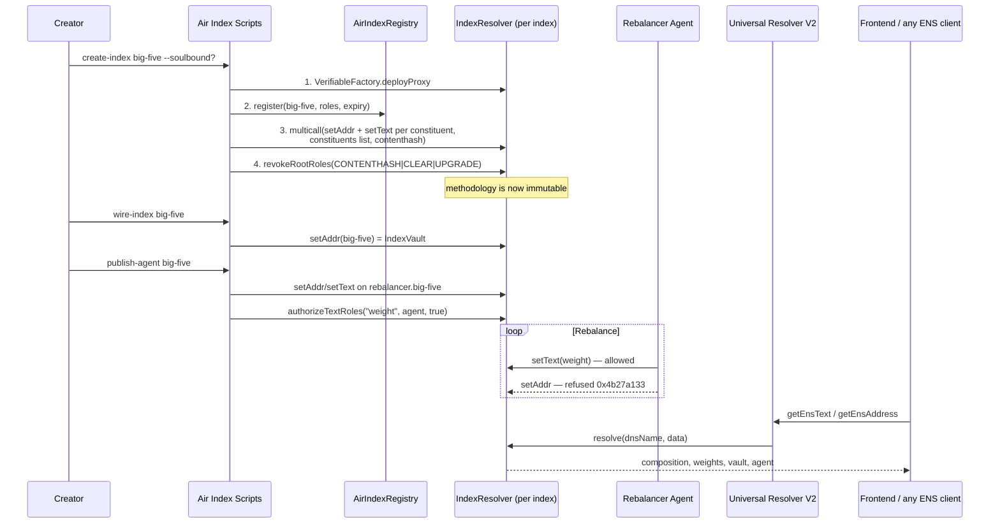
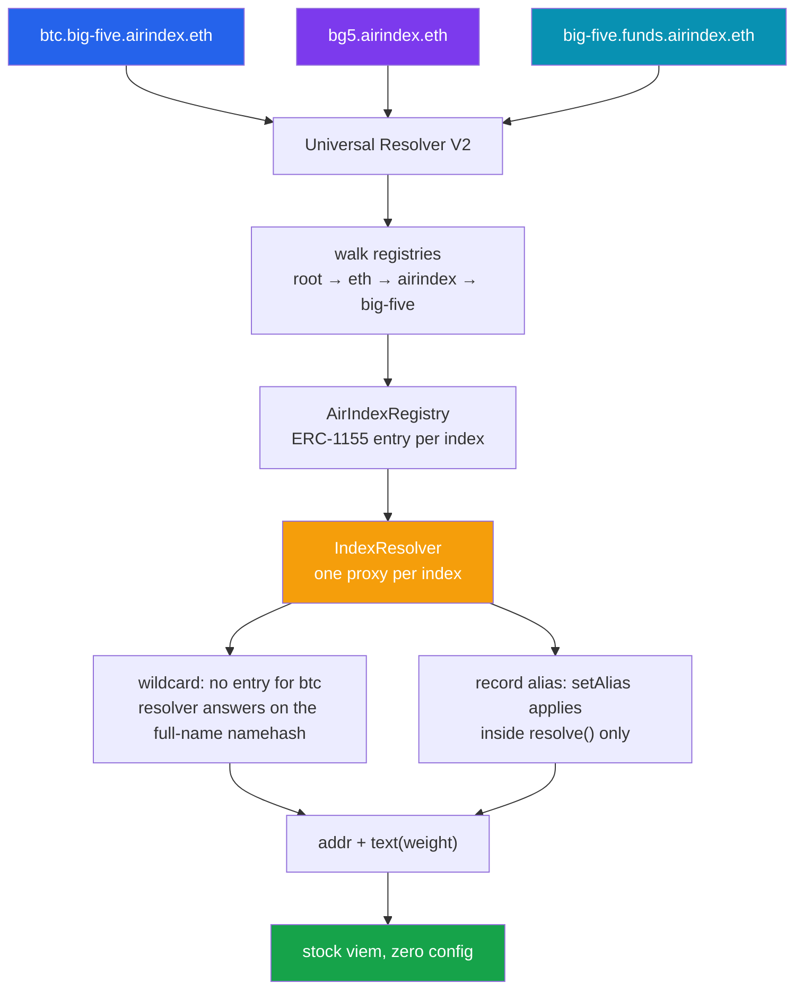

<p align="center">
  
</p>

<h1 align="center">Air Index</h1>

<p align="center">
  Crypto index funds where the ENS name <em>is</em> the fund — composition, custody rules and the rebalancing agent all live in the namespace.
</p>

<p align="center">
  <a href="https://air-index-ens.vercel.app"><strong>Live demo</strong></a>
  ·
  <a href="https://sepolia.etherscan.io/address/0xc218969258bf134e4e330e30Fa45E834386b92F2">AirIndexRegistry on Sepolia</a>
</p>

---

Air Index is an index-fund protocol built entirely on **ENSv2 (Sepolia beta)**. An index is not a row in a database that happens to have a name attached — it is a name. `big-five.airindex.eth` resolves to its own share token, its constituents are subnames nobody registered, its methodology is locked by burnt resolver roles, and its rebalancing agent is itself a name with an address, a published mandate, and exactly one record it is allowed to write.

> **Delete our frontend and the product still exists.** Every fact about a fund is readable with stock viem and no configuration.
>
> - `getEnsText('big-five.airindex.eth', 'constituents')` → `btc,eth,sol,xrp,doge`
> - `getEnsAddress('btc.big-five.airindex.eth')` → the token — and that subname is **registered nowhere**
> - `getEnsAddress('big-five.airindex.eth')` → the share token you actually hold

---

## What Makes Air Index Special

### Who This Is For

Meet Rani. She has been picking crypto baskets for her group chat for two years — five names, quarterly rebalance, a Google Sheet everyone screenshots. It works until someone asks the only question that matters: *how do I know you didn't change the weights after the fact?*

She could publish to IPFS, but nobody checks a CID. She could deploy a vault contract, but then she owns everyone's funds and the composition lives in storage only her ABI can read. She could use an index protocol, but every one of them wants her methodology inside their app, discoverable only through their frontend, priced by their token.

Rani's problem is not a missing tool. It is that there is no namespace where a fund's composition is **the public record itself** — readable by any ENS library, provably frozen, and delegable to an agent for the numbers while the rules stay untouchable.

---

### The Problem

An index fund is two things: a set of rules, and a set of numbers that move. Every existing structure blurs them.

- **Off-chain methodology (IPFS, PDFs, docs sites)** — the composition and the document drift apart, and nobody diffs a CID
- **Vault-contract indexes** — composition lives in contract storage, readable only through that protocol's ABI and frontend; the operator who can rebalance can usually also rewrite the mandate
- **Multisig-governed baskets** — "we promise not to change it" is a social guarantee with a quorum, not a mechanical one
- **Spreadsheet baskets** — no provenance, no enumeration, no way to prove what was published when

And none of them give the *rebalancing agent* an identity. It is an address in a config file, or a key in a backend, with implicit permission to do anything the operator can do.

**How might we publish a fund so that its composition is the public record, its methodology is provably immutable, and its agent can move the numbers but never the rules?**

---

### The Solution

Air Index answers with six ENSv2 primitives, each doing a job no other layer does.

**1. Constituents as wildcard subnames** — `btc.big-five.airindex.eth` resolves an address and a weight, and it is **registered nowhere**. There is no ERC-1155 entry, no registration gas, no expiry to renew. The parent's Permissioned Resolver answers for the whole subtree via ENSIP-10 wildcard resolution, so a 30-asset index costs the same in registry state as a 2-asset one.

**2. One Permissioned Resolver per index** — every index gets its own resolver proxy from the Verifiable Factory. Roles are per-resolver, so one creator's decisions cannot reach another's. `verifyContract` on the factory proves the proxy is a genuine instance of the audited implementation, and the UI renders that as a badge rather than asserting it.

**3. A methodology lock that is a fact, not a promise** — after publishing, the creator calls `revokeRootRoles(SET_CONTENTHASH | CLEAR | UPGRADE + their admin variants)`. All three, not just the first: `UPGRADE` would swap the implementation for one that ignores access control, and `CLEAR` would bump the record version so the locked value reads back empty. Afterwards `roleCount(ROOT_RESOURCE)` returns zero for those nybbles — one public call anyone can make, and nobody, including us, can undo it.

**4. An agent that is a namespace, not an address** — `rebalancer.big-five.airindex.eth` resolves to the agent's address, publishes its mandate in words, and names the single record key it may write. Enhanced Access Control scopes it with `authorizeTextRoles(name, "weight", agent, true)`: the agent can set weights and is refused on `setAddr`, on `description`, on everything else. It also holds the `mandate` key on its *own* name, so it maintains its own description without being able to touch the fund.

**5. Both aliasing mechanisms, because one is not enough** — record aliasing gives an index a ticker (`bg5.airindex.eth`). Namespace aliasing gives the whole protocol a second home: `funds.airindex.eth` points its subregistry at the Air Index registry, so `big-five.funds.airindex.eth` is the same ERC-1155 entry. Sharing the registry alone ships an empty mirror — resolution hashes the *full* name — so record aliasing supplies the other half.

**6. Names shaped to their purpose** — expiring by default, soulbound on request (omit `CAN_TRANSFER_ADMIN` at registration and the choice is permanent), delegations revocable, and a forever name in a registry whose root roles were burnt after a single registration.

---

## Name Setups

ENSv2 lets a subname be configured, not just created. Air Index ships one of each, live on Sepolia.

| | **Wildcard constituent** | **Registered index** | **Agent namespace** | **Forever name** |
|---|---|---|---|---|
| **Example** | `btc.big-five.airindex.eth` | `big-five.airindex.eth` | `rebalancer.big-five.airindex.eth` | `charter.safe-stables.airindex.eth` |
| **Registry entry** | none — resolves off the parent | ERC-1155 in AirIndexRegistry | none — wildcard | ERC-1155 in a dedicated registry |
| **Expiry** | inherits the parent | 1 year, renewable | inherits the parent | `type(uint64).max` |
| **Transferable** | n/a | yes, unless registered soulbound | n/a | no |
| **Who can write** | index owner + agent (`weight` only) | index owner | agent (`mandate` on its own name) | holder |
| **Parent control** | full | full | full | **none** — root roles revoked |
| **Cost to create** | zero | one register + one multicall | zero | one registry + one register |

### Why each shape earns its place

Wildcards make a 30-asset index as cheap as a 2-asset one. Registered entries make an index ownable and transferable. The agent namespace turns a key in a config file into something with a public mandate. The forever name proves the protocol can hand out a subname it can never take back — the strongest guarantee a parent can offer, and the one nobody offers by accident.

### Decision flow when publishing an index

```
create-index <slug> [--soulbound]
  ├─ deploy a Permissioned Resolver proxy for this index alone
  ├─ register <slug>          (CAN_TRANSFER_ADMIN omitted → soulbound, permanently)
  ├─ multicall
  │    ├─ setAddr / setText per constituent   ← wildcard, no registration
  │    ├─ setText(constituents)               ← enumeration lifeline
  │    └─ setContenthash(methodology)
  └─ revokeRootRoles(CONTENTHASH | CLEAR | UPGRADE)   ← irreversible

wire-index <slug>       → share token + addr records
publish-agent <slug>    → agent name + scoped weight key
```

---

## Features

- **Wildcard Constituents**: every asset in an index is a subname registered nowhere — zero registry state, zero registration gas, zero renewals, readable with stock viem
- **Per-Index Permissioned Resolver**: one factory-verified proxy per index, so role decisions never leak across creators
- **Provable Methodology Lock**: `SET_CONTENTHASH`, `CLEAR` and `UPGRADE` burnt together; `roleCount(0)` is the proof and the UI badge reads it live
- **Agent as a Namespace `ENSv2`**: `rebalancer.<index>.airindex.eth` with a resolvable address, a published mandate, and a declared `delegated-key`
- **Record-Scoped Delegation via EAC**: the agent may write `weight` and is refused `addr`, `description` and every other key — proven by simulation in the script itself
- **Revocable Delegation**: `publish-agent <slug> --revoke` takes the key back and asserts the refusal; the agent keeps its name and mandate
- **Record Aliasing (tickers)**: `bg5.airindex.eth` resolves identically to `big-five.airindex.eth`
- **Namespace Aliasing (mirrors)**: `funds.airindex.eth` shares the Air Index registry, so every index appears under a second name as the same ERC-1155 entry
- **Soulbound Indexes**: `--soulbound` omits `CAN_TRANSFER_ADMIN`, which cannot be granted afterwards — the choice exists for exactly one transaction
- **Forever Names with No Parent Control**: max-uint64 expiry in a registry whose root roles were revoked after one registration; the deployer is refused when it tries to register again
- **Real Settlement**: `IndexVault` share tokens, published as `addr(60)` on the index name — the app resolves the name to find the fund and hardcodes no vault address anywhere
- **In-App Testnet Faucet**: 14 mock ERC20s mintable from the navbar, so a judge can fund a wallet without a script
- **Deposit / Redeem / Swap**: real transactions against real contracts, with the preview and the receipt both read from the vault that settles them
- **Onchain-First UI**: constituents, weights, lock state, resolver provenance, share token, ownership and expiry all resolved from names — the local catalogue supplies only what ENS has no opinion about
- **Two Runnable Gates**: `check:ens` (constants, encodings, one live wildcard read) and `check:onchain` (weights total 10,000 bps, every resolved address has bytecode, vault round trip never returns more than it took)

---

## Tech Stack

| Layer | Technology |
|---|---|
| Frontend | Next.js 16, React 19, TypeScript, Tailwind CSS v4 |
| Naming | ENSv2 beta on Sepolia — Permissioned Registry, Permissioned Resolver, Enhanced Access Control, Universal Resolver V2 |
| Wallet Integration | viem 2.56 + raw EIP-1193 (no connector library) |
| Blockchain | Ethereum Sepolia (chainId 11155111) |
| Smart Contracts | `MockERC20`, `IndexVault` (Solidity 0.8.28, Foundry, zero dependencies) |
| Proxies | ENS Verifiable Factory (`deployProxy` + `verifyContract`) |
| Scripts | tsx + viem, private keys confined to `scripts/` |
| Animation | Motion (Framer Motion) |
| Type | Geist Mono for names, Apple system stack for UI |
| Lint / Format | Biome |

---

## ENSv2 Integration

Air Index is built directly on the **Permissioned Registry**, **Permissioned Resolver**, **Enhanced Access Control**, and **Universal Resolver V2**. Every read in the product goes through the Universal Resolver, and every write is a raw `writeContract` against ABIs extracted from the deployed revision. Here are the core integration points:

| Component | File | Description |
|---|---|---|
| **Verified Deployments** | [`src/lib/ens/deployments.ts`](apps/frontend/src/lib/ens/deployments.ts) | Every ENSv2 Sepolia address, each confirmed to have bytecode. Source is `ensdomains/contracts-v2` at tag `sepolia-deployment-2026-07-31`, **not** the repo default branch |
| **Role Constants + Lock** | [`src/lib/ens/roles.ts`](apps/frontend/src/lib/ens/roles.ts) | Resolver and registry role bitmaps (nybble-packed, 4 bits per role), the methodology lock bitmap, `getAssigneeCount`, `isMethodologyLocked`, `isTransferable` |
| **Universal-Resolver Reads** | [`src/lib/ens/read.ts`](apps/frontend/src/lib/ens/read.ts) | The only read path. Aliases apply *inside* `resolve()` and wildcards are only reachable through it — a direct resolver call returns empty with no error on both, which is why there is one helper and no exceptions |
| **Index Discovery** | [`src/lib/ens/indexes.ts`](apps/frontend/src/lib/ens/indexes.ts) | `LabelRegistered` logs bounded by the recorded deploy block, then resolver, owner, expiry, share token, agent, lock state and factory provenance per index |
| **Name Encoding** | [`src/lib/ens/name.ts`](apps/frontend/src/lib/ens/name.ts) | `normalize` before hashing, namehash for record setters, DNS encoding for `authorize*` and `setAlias` — mixing the two authorizes the wrong resource silently |
| **Protocol Bootstrap** | [`scripts/bootstrap.ts`](apps/frontend/scripts/bootstrap.ts) | Mints MockUSDC, commits and registers `airindex.eth`, deploys the protocol resolver + AirIndexRegistry as factory proxies, `setParent`, then revokes `SET_PARENT` in the same run |
| **Index Publication** | [`scripts/create-index.ts`](apps/frontend/scripts/create-index.ts) | Resolver proxy → register (`--soulbound` omits `CAN_TRANSFER_ADMIN`) → one multicall for every constituent record → `revokeRootRoles` |
| **Agent Namespace** | [`scripts/publish-agent.ts`](apps/frontend/scripts/publish-agent.ts) | Publishes `rebalancer.<index>`, scopes `weight` per constituent via `authorizeTextRoles`, grants the agent `mandate` on its own name, then **simulates the agent** to prove `weight` is allowed and `addr` / `description` are refused. `--revoke` reverses it and asserts the refusal |
| **Scoped Rebalance** | [`scripts/rebalance.ts`](apps/frontend/scripts/rebalance.ts) | Signs as the **agent**, not the owner, so a successful run is itself the evidence that record-scoped delegation holds. Asserts the index stays at 10,000 bps |
| **Tickers and Mirrors** | [`scripts/set-alias.ts`](apps/frontend/scripts/set-alias.ts) | Record aliasing. Tickers and mirrors are one primitive: register the alias onto the *target's* resolver, then `setAlias` there |
| **Namespace Mirror** | [`scripts/mirror-namespace.ts`](apps/frontend/scripts/mirror-namespace.ts) | Registers a label whose subregistry is the Air Index registry, then record-aliases each index onto it. Simulates before sending, so a resolver without `SET_ALIAS` costs no gas |
| **Forever Name** | [`scripts/forever-name.ts`](apps/frontend/scripts/forever-name.ts) | Dedicated registry → max-uint64 expiry → attach as a subregistry → `revokeRootRoles` → prove the parent is refused. Checks a wildcard constituent still resolves before anything irreversible |
| **Onchain Wiring** | [`scripts/wire-index.ts`](apps/frontend/scripts/wire-index.ts) | Deploys the share token and publishes `addr(60)` on the index name and every constituent, then reads all of it back through the Universal Resolver |
| **Gate: offline + live** | [`scripts/check-ens.ts`](apps/frontend/scripts/check-ens.ts) | Role constants, encodings, and one live wildcard read |
| **Gate: full state** | [`scripts/check-onchain.ts`](apps/frontend/scripts/check-onchain.ts) | Every published index: weights total 10,000 bps, every resolved address has bytecode, ownership and expiry, vault round trip never returns more than it took |
| **Gate probes** | [`scripts/probe-w1.ts`](apps/frontend/scripts/probe-w1.ts) · [`w2`](apps/frontend/scripts/probe-w2.ts) · [`w3`](apps/frontend/scripts/probe-w3.ts) | W1 wildcard on a name registered nowhere, W2 methodology lock on a throwaway resolver, W3 scoped delegation refused outside its key |
| **Onchain Panel** | [`components/pages/index-detail/components/OnchainPanel.tsx`](apps/frontend/src/components/pages/index-detail/components/OnchainPanel.tsx) | Resolver, owner, share token, ownership, expiry, factory provenance and lock state — all read, none asserted |
| **Rebalancer Card** | [`components/pages/index-detail/components/RebalancerCard.tsx`](apps/frontend/src/components/pages/index-detail/components/RebalancerCard.tsx) | Renders the agent entirely from `rebalancer.<index>.airindex.eth` |

### ENSv2 surface in use

| Contract | Call | Purpose |
|---|---|---|
| ETHRegistrar | `commit` → `register` | Registers `airindex.eth` with subregistry and resolver passed inline, saving two transactions |
| Permissioned Registry | `register(label, owner, subregistry, resolver, roles, expiry)` | Every index; roles chosen here decide transferability forever |
| Permissioned Registry | `setSubregistry` | Namespace aliasing, and hanging the forever registry under an index |
| Permissioned Registry | `roleCount(tokenId)` | Reads `CAN_TRANSFER_ADMIN` to show soulbound versus transferable |
| Permissioned Resolver | `multicall([setAddr, setText, setContenthash])` | Whole composition in one transaction — 13 record writes for a 5-asset index |
| Permissioned Resolver | `revokeRootRoles(CONTENTHASH \| CLEAR \| UPGRADE)` | The methodology lock. Irreversible |
| Permissioned Resolver | `authorizeTextRoles(dnsName, key, account, bool)` | Record-scoped delegation — the agent's entire authority |
| Permissioned Resolver | `setAlias(dnsFrom, dnsTo)` | Tickers and mirrored names |
| Permissioned Resolver | `roleCount(ROOT_RESOURCE)` | The lock badge, read live by anyone |
| Universal Resolver V2 | via `viem.getEnsText` / `getEnsAddress` | Every read. Sepolia's built-in `ensUniversalResolver` already points at it, so **zero config** |
| Verifiable Factory | `deployProxy` / `verifyContract` | Per-index resolvers, and provenance back to the audited implementation |

---

## Architecture

### System Flow



### Resolution Pipeline



A direct call to `IndexResolver` for either the wildcard or the alias returns **empty with no revert**. That asymmetry is why the app has exactly one read helper and it goes through the Universal Resolver.

---

## Setup

### Smart Contract Setup

```bash
# Install Foundry
curl -L https://foundry.paradigm.xyz | bash
foundryup

# Clone the repository
git clone https://github.com/0xpochita/air-index.git
cd air-index/apps/contracts

# Build — no dependencies, no network access needed
forge build
```

### Frontend Setup

```bash
cd air-index/apps/frontend

# Install dependencies
pnpm install

# Configure environment variables
cp .env.example .env
# Edit .env:
#   SEPOLIA_RPC_URL=https://ethereum-sepolia-rpc.publicnode.com
#   NEXT_PUBLIC_SEPOLIA_RPC_URL=https://ethereum-sepolia-rpc.publicnode.com
#   DEPLOYER_PRIVATE_KEY=0x...          (throwaway testnet key, funded from a faucet)
#   REBALANCER_PRIVATE_KEY=0x...        (throwaway agent key)
#   NEXT_PUBLIC_AIR_INDEX_REGISTRY=     (written by bootstrap)
#   NEXT_PUBLIC_AIR_INDEX_FROM_BLOCK=   (written by bootstrap)

# Start development server
pnpm dev
```

Open [http://localhost:3000](http://localhost:3000). The app reads the live Sepolia deployment out of the box — connect a wallet, mint from the navbar faucet, and deposit.

Or skip the setup entirely: **[air-index-ens.vercel.app](https://air-index-ens.vercel.app)** runs against the same contracts. You need a wallet on Sepolia with a little test ether for gas; every token you trade with is mintable from the faucet in the navbar.

### Publishing your own protocol

```bash
pnpm check:ens                          # constants, encodings, one live wildcard read
pnpm probe:w1 && pnpm probe:w2          # the two gates that decide the architecture
pnpm bootstrap                          # registers airindex.eth, one time, idempotent
pnpm deploy-tokens [csv|all]            # mock ERC20s for the constituents you need
pnpm create-index <slug> [--soulbound]
pnpm wire-index <slug>                  # share token + addr records
pnpm publish-agent <slug> [--revoke]    # agent namespace + scoped weight key
pnpm set-alias <alias> <targetSlug>     # tickers and mirrors
pnpm mirror-namespace [label]           # namespace aliasing across the whole registry
pnpm forever-name <slug> [label]        # max expiry, root roles burnt
pnpm rebalance <index.eth> <sym> <bps>  # signs as the agent
pnpm check:onchain                      # the full gate
```

> **Two traps worth knowing.** Next does not reload env vars without a restart, so a dev server started before `bootstrap` will not see the registry. And public RPCs reject `eth_getLogs` from genesis at a 50k block cap, which is why the deploy block is recorded and the listing query is bounded by it.

---

## How It Works

### Creator Flow

```
Publish index → Lock methodology → Wire settlement → Delegate an agent
```

1. **Publish** — one resolver proxy, one registration, one multicall carrying every constituent's address and weight, the enumeration list, and the methodology contenthash
2. **Lock** — `revokeRootRoles` burns contenthash, clear and upgrade together; `roleCount(0)` reads zero forever after
3. **Wire** — deploy the `IndexVault` share token and publish it as `addr(60)` on the index name, so resolving the name *is* finding the fund
4. **Delegate** — publish `rebalancer.<index>` and scope the `weight` key to it; the script proves the scope by simulating the refusals

### Agent Flow

```
Read the mandate → Set weights → Be refused everywhere else
```

1. **Identity** — the agent's address, mandate and permitted key are all resolvable from `rebalancer.<index>.airindex.eth`; nothing about it lives in a config file
2. **Act** — `setText(<symbol>.<index>, "weight", bps)` signed by the agent key
3. **Bounded** — `setAddr` and every other text key revert `EACUnauthorizedAccountRoles` (`0x4b27a133`)
4. **Revocable** — the owner calls `authorizeTextRoles(..., false)`; the agent keeps its name and its published mandate, and loses the key

### Reader Flow

```
Resolve a name → Have the whole fund
```

```ts
import { createPublicClient, http } from "viem";
import { sepolia } from "viem/chains";

const client = createPublicClient({ chain: sepolia, transport: http() });

// No SDK, no ABI, no address, no config.
await client.getEnsText({ name: "big-five.airindex.eth", key: "constituents" });
// 'btc,eth,sol,xrp,doge'

await client.getEnsAddress({ name: "btc.big-five.airindex.eth" });
// 0x9D453Ba64B6a5Be1371044278aCDC53dc22657a1  ← registered nowhere

await client.getEnsAddress({ name: "big-five.airindex.eth" });
// 0xBF848a0EbBa9FFA4f76fD2dD42C4AC49074CdC2E  ← the fund itself

await client.getEnsText({ name: "rebalancer.big-five.airindex.eth", key: "mandate" });
// 'Reset every constituent to a 20.00% target allocation each month.'
```

### On-Chain Flow

```
Creator                     AirIndexRegistry            IndexResolver            Agent
   │                              │                          │                     │
   ├── deployProxy ───────────────┼─────────────────────────►│ (factory verified)  │
   ├── register(slug, roles) ────►│ ERC-1155 entry           │                     │
   ├── multicall(records) ────────┼─────────────────────────►│ wildcard subnames   │
   ├── revokeRootRoles ───────────┼─────────────────────────►│ methodology LOCKED  │
   ├── setAddr(slug) = vault ─────┼─────────────────────────►│                     │
   ├── authorizeTextRoles ────────┼─────────────────────────►│◄── weight only ─────┤
   │                              │                          │                     │
   ◄── anyone: getEnsText / getEnsAddress via Universal Resolver ─────────────────►
```

---

## Smart Contract Details

### Addresses (Sepolia)

**ENSv2 beta — read from the ENS deployments page, each confirmed to have bytecode**

| Contract | Address |
|---|---|
| `ETHRegistry` | `0xbdc85dd5b15d7ecb354cd7cb6f2c50b4f2c4f0e2` |
| `ETHRegistrar` | `0xa88553f454b77203b0d036a05c894d555eaaa2cc` |
| `UniversalResolverV2` | `0x4a1817d13e9cf196f471725176355c1234b63c70` |
| `VerifiableFactory` | `0x10dc6333cdfe1fcef624c6e0a8221b91804cd7ef` |
| `PermissionedResolver` impl | `0x9eae5c2730a7dd16bdd1dee6421a1b91e3b0365e` |
| `UserRegistry` impl | `0x624a25d67b59d587752ebec8dded8827dae52050` |

**Air Index**

| What | Address |
|---|---|
| `airindex.eth` owner | `0x8bf8ff82524026dae7DcF990409f95B5F6268149` |
| AirIndexRegistry | `0xc218969258bf134e4e330e30Fa45E834386b92F2` |
| Protocol resolver | `0xc6CcE73dAfECe18be8C40E5ACA095B63cc01Cf13` |
| `defi-blue` resolver | `0x5Ee981c64503d4e5d6cBF0Dcff8016834af0dD81` |
| `big-five` resolver | `0xCd180010C9Ca2C68e8468133b91657837E110A1a` |
| `safe-stables` resolver | `0x3d1660C43382ca172EFf046Ec547E7ac3f714e4E` |
| Forever registry | `0x1B3520B9914E9D216504962953D0E1386394cFE4` |
| Rebalancing agent | `0x1Ace68e53E3885fcD889A143E17b253b550761e2` |
| Registry deploy block | `11665458` |

**Settlement**

| What | Address | Note |
|---|---|---|
| `mUSDC` | `0xe322a0033293e8bcfa75c3b2cc52db591091148b` | 6 decimals, open faucet, every vault settles here |
| `DFBL` share token | `0x8622a02b581c23FA7Ad67103428664ae739FaFB1` | `defi-blue`, 124.18 mUSDC/share |
| `BG5` share token | `0xBF848a0EbBa9FFA4f76fD2dD42C4AC49074CdC2E` | `big-five`, 161.42 mUSDC/share |
| `SAFE` share token | `0xc0244F8f15DBF61aca6B9623803c7AdC0F45660A` | `safe-stables`, 100.04 mUSDC/share, soulbound index |

14 mock ERC20s live in total — addresses in [`sepolia-tokens.json`](apps/frontend/src/lib/mock/sepolia-tokens.json).

### Key Functions

#### IndexVault

```
deposit(quoteAmount) → shares = quoteAmount * 1e18 / sharePrice
redeem(shares)       → quote  = shares * sharePrice / 1e18
previewDeposit / previewRedeem                    — the same maths, callable for free
ensName()                                         — the name whose records this vault tracks
```

The price is fixed, so the vault is solvent by construction: it only ever owes back what a depositor put in, and integer division rounds toward the vault. It deliberately does **not** store the composition — that lives in the ENS records, and a second copy in storage could disagree with the name.

#### MockERC20

```
mint(to, value)      — public on purpose; judges need to fund a wallet without asking anyone
faucet()             — 1,000 whole units per claim, unlimited
```

#### ENS helpers

```
toDnsEncoded(name)                        — authorize* and setAlias take DNS-encoded names
toNode(name)                              — record setters take namehashes; mixing them fails silently
isMethodologyLocked(roleCount)            — decodes the nybbles for CONTENTHASH, CLEAR, UPGRADE
isTransferable(tokenRoleCount)            — decodes CAN_TRANSFER_ADMIN on a registry entry
readAgent(indexEnsName)                   — the agent's address, mandate and delegated key
fetchLiveIndexes()                        — every published index, with the share token it settles in
```

> For the full research behind each decision — including the ENS docs' own methodology-lock example being incomplete — see the verification notes referenced in the commit history.

---

## Deployment Checklist

- [x] `airindex.eth` registered on ENSv2 Sepolia with subregistry + resolver wired inline
- [x] AirIndexRegistry deployed as a Verifiable Factory proxy, `setParent` then `SET_PARENT` revoked
- [x] Per-index Permissioned Resolver proxies, factory-verified
- [x] Wildcard constituents — subnames registered nowhere, resolved with stock viem
- [x] Methodology lock — `SET_CONTENTHASH` + `CLEAR` + `UPGRADE` and their admins, burnt together
- [x] Record-scoped delegation via Enhanced Access Control
- [x] **Agent as a namespace** — address, mandate and `delegated-key` published under `rebalancer.<index>`
- [x] **Revocable delegation** — `--revoke` takes the key back and proves the refusal
- [x] **Record aliasing** — `bg5.airindex.eth`
- [x] **Namespace aliasing** — `funds.airindex.eth` sharing the registry
- [x] **Soulbound index** — `safe-stables`, `CAN_TRANSFER_ADMIN` omitted permanently
- [x] **Forever name, no parent control** — max-uint64 expiry, root roles burnt
- [x] Real settlement — `IndexVault` share tokens discovered through `addr(60)` on the index name
- [x] 14 mock ERC20s with an in-app faucet
- [x] Deposit / redeem / swap against live contracts, with animated confirmations
- [x] Two runnable gates (`check:ens`, `check:onchain`) plus three probes
- [x] Live demo deployed — [air-index-ens.vercel.app](https://air-index-ens.vercel.app)
- [ ] Demo video
- [ ] `/indexes/<alias>` falls back to the chain when a slug is absent from the local catalogue
- [ ] Index creation from the browser (today the registrar role lives with the deployer)
- [ ] A price oracle — share prices are fixed at launch, so an index never gains or loses value

**Two permanent consequences worth naming.** `defi-blue` shipped without `SET_ALIAS`, which is root-only and cannot be added afterwards — it can never have a ticker or a mirror. And `UNREGISTER_ADMIN` was never granted at bootstrap, so an index cannot be revoked by role; entries expire instead, and delegations are separately revocable. Both are recorded rather than hidden, because the ordering rules that caused them are the most expensive thing we learned.

---

## Hackathon Submission

| | |
|---|---|
| **Event** | ETHGlobal Hackathon |
| **Track** | ENS: Best Use of ENSv2 |
| **Network** | Ethereum Sepolia (ENSv2 beta) |
| **Live demo** | [air-index-ens.vercel.app](https://air-index-ens.vercel.app) |
| **Source** | [github.com/0xpochita/air-index](https://github.com/0xpochita/air-index) |

---

## License

MIT

---

> The name is the fund — Air Index
